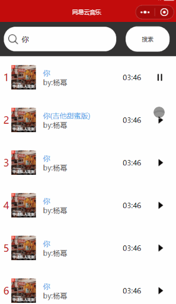

一、异步代码变为同步

```
promise 
async 
await
```

## 二、自定义属性

```
<view data-id="{{item.id}}" bind:tap="handleClick"></view>
```

```
handleClick(event){
    var id = event.currentTarget.dataset.id;
}
```

## 三、音乐播放

### 3-1 传递下标获取item的值

```
//dataset自定属性,传递下标获取值
<view class="item" data-id="{{index}}" bind:tap="handlePlay"></view>
```

```
Page({
    data:{
        musics:[]
    },
    ....
    handlePlay(event){
        var {index} = event.currentTarget.dataset;
        var item = this.data.musics[index];
        var {id,name,musicUrl} = item;
        console.log(item)
    }
})
```

### 3-2  点击item的id和for循环id相同,图片改变



```
//index.js
Page({
    data:{
        musics:[],
        //记录点击之后的id值
        prevId:""
    }，
    handlePlay(event){
        .....
        this.setData({
            prevId:id
        })
    }
})
//index.wxss
```

> Tip:但是这里会产生一个问题,点击按钮不会切换状态

### 3-3 按钮切换

```
//index.js
//1.
Page({
    data:{
        ...
        //记录音乐是否播放
        prevId:"",
        isPlay:false
    },
    handlePlay(event){
        this.setData({
            prevId:id,
            //2.isPlay的值进行取反
            isPlay:!this.data.isPlay
        })
    }
})
//3.更新视图  isplay是true,prevId==item.id才会显示播放的图片
 <image class="play" src="{{isPlay&&prevId==item.id?'/images/play.png':'/images/pause.png'}}"></image>
```

> Tips:产生了一个问题,上一个item是播放的状态,点击下一个item它不会进行播放的状态

### 3-4解决item之间播放按钮切换的问题

> 当两个item的id值不一样的时候,让下一个item播放按钮isPlay为true

```
var {index} = event.currentTarget.dataset
    var {id,name,musicUrl} = this.data.musics[index];
    //核心逻辑
    if (id !== this.data.prevId) {
      this.setData({
        isPlay: true,
        prevId: id
      })
    } else {
      /* 点击之后,将id设置给prevId */
      this.setData({
        prevId: id,
        isPlay: !this.data.isPlay
      })
    }
```

### 3-5 音乐播放

```
//1.设置audio
const audio = wx.getBackgroundAudioManager()
Page({
	....
    handlePlay(event) {
    var {index} = event.currentTarget.dataset
    var {id,name,musicUrl} = this.data.musics[index];
    if (id !== this.data.prevId) {
      audio.title = name;
      audio.src = musicUrl;
      this.setData({
        isPlay: true,
        prevId: id
      })
    } else {
      /* 点击之后,将id设置给prevId */
      if(this.data.isPlay){
        audio.pause();
        this.setData({
          isPlay:false
        })
      }else{
        audio.title = name;
        audio.src = musicUrl;
        this.setData({
          isPlay:true
        })
      }
    }
  }
})
```

## 四、封装http

```
var baseUrl ="https://music.aityp.com/"
function http({url,data,callback}){
    wx.request({
        url: baseUrl+url,
        data: {},
        header: {'content-type':'application/json'},
        method: 'GET',
        dataType: 'json',
        responseType: 'text',
        success: (res)=>{
            callback(res)
        }
    });
}
module.exports = http;
```

调用

```
const http = require('../../util/http.js');
Page({
  data: {

  },
  onLoad: function (options) {
    http({
      url:"mv/first",
      callback:this.handleData
    })
  },
  handleData(res){
    console.log(res)
  }
})
```

### 4-1 再次封装http

```
var baseUrl ="https://music.aityp.com/"
function http({url,data,success}){
    wx.request({
        url: baseUrl+url,
        data: {},
        header: {'content-type':'application/json'},
        method: 'GET',
        dataType: 'json',
        responseType: 'text',
        success: (res)=>{
           success(res)
        }
    });
}
// module.exports = http;
module.exports = {
    getMvData:(callback)=>{
        http({
            url:'mv/first',
            success:res=>{
                callback(res)
            }
        })
    },
    getMvUrl:(id,callback)=>{
        http({
            url:`mv/url?id=${id}`,
            success:res=>{
                callback(res)
            }
        })
    }
}
```

## 五、小程序中的跳转

```
 //1.携带参数跳转到另一个页面
 <view bind:tap="handleClick" data-id="{{item.id}}"></view>
 handleClick(event){
    var {id} = event.currentTarget.dataset
    wx.navigateTo({
      url: '/pages/mvPlay/mvPlay?id='+id,
})
  }
```

```
//2.在跳转页面接收参数
Tips: 在跳转页面的onLoad函数中接收参数
onLoad: function (options) {
    console.log(options)
  },
```

